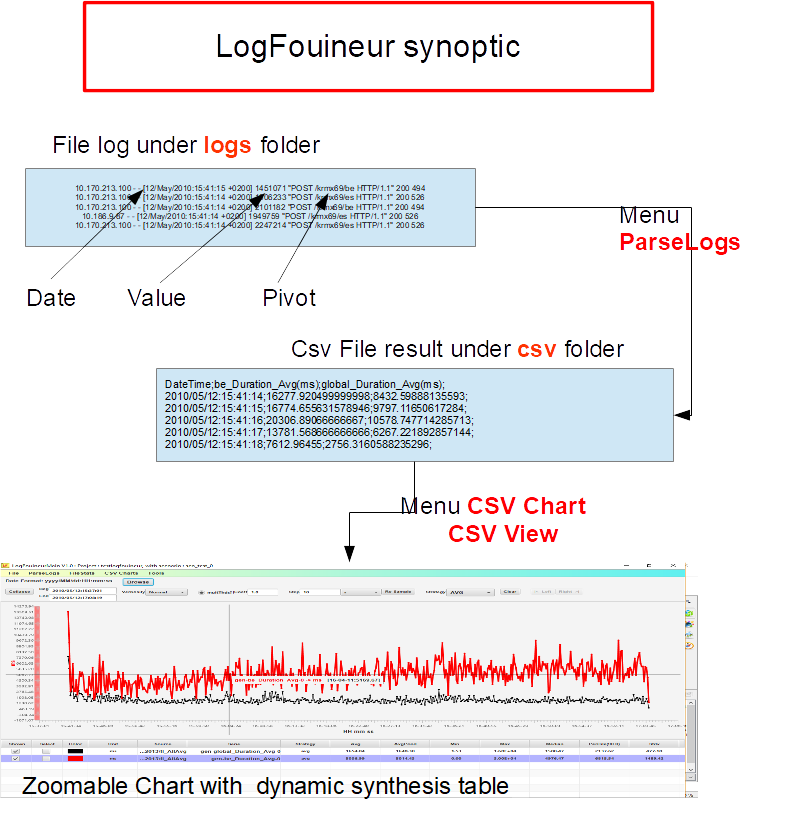

<!DOCTYPE HTML PUBLIC "-//W3C//DTD HTML 4.0 Transitional//EN">
<html>
<head>
	<meta http-equiv="content-type" content="text/html; charset=utf-8"/>
	<title></title>
	<meta name="generator" content="LibreOffice 5.4.5.1 (Linux)"/>
	<meta name="created" content="2018-03-27T09:10:02.509863952"/>
	<meta name="changed" content="2018-03-27T09:27:46.408115055"/>
</head>
<body lang="en-US" dir="ltr">
<ol>
	<li/>

<b>LogFouineur</b>

</ol>

This
application parse different types of logs that are explicitly or
implicitly dated.

It
runs in two phases :

-
First parse logs and generate a CSV files. Each line is dated with a
recognized java format date or timestamp in milliseconds.

-
A csv viewer that can graph the series.

<ol start="2">
	<li/>

<b>Requirements</b>

</ol>

Oracle Java SE 9+/Java FX 9+. Not tested with Open JDK

License <b>LogFouineur </b>: Apache 2

<ol start="3">
	<li/>

<b>Launch</b>

</ol>

The
scripts are under folder scripts:

For
a Linux desktop :

#!/bin/bash

export
root=/opt/workspace47/<u>logfouineur</u>

<u>export
workspace=/opt/workspaceLP</u>

/opt/<u>jdk</u>-9.0.4/bin/java
-Xms1024M -Xmx1024M -<u>Droot</u>=${root}
-<u>Dworkspace</u>=${workspace}
 --module-path ${root}/<u>libs</u>:${root}/libExt
-m org.jlp.logfouineur/org.jlp.logfouineur.ui.LogFouineurMain

 
 

For
a Windows desktop :

set
JAVA_HOME=C:\Program Files\Java\<u>jdk</u>-9.0.4

set
root=C:\opt\workspace47\<u>logfouineur</u>

set
workspace=C:\opt\workspaceLP

&quot;%JAVA_HOME%\bin\java&quot;
-Xms1024M -Xmx1024M -<u>Droot</u>=%root%
-<u>Dworkspace</u>=%workspace%
 --module-path %root%\<u>libs</u>;%root%\libExt;%root%\myPlugins
-m org.jlp.logfouineur/org.jlp.logfouineur.ui.LogFouineurMain

 

<ol start="4">
	<li/>

<b>Synoptics</b>

</ol>

 
 

</body>
</html>